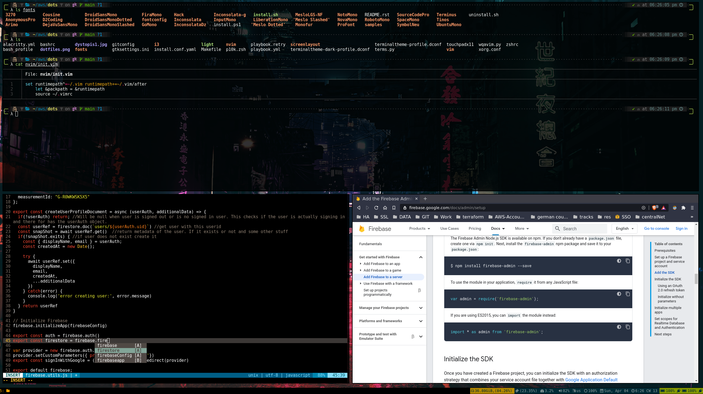
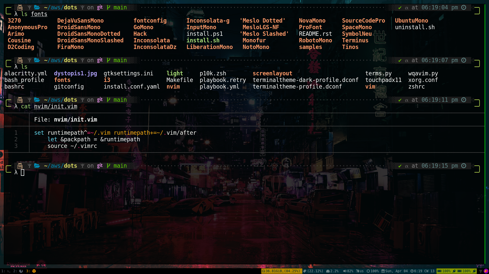

# Dotfiles

1. To set up our workstation we must first execute `sudo make setup`.
This will install ansible and necessary packages to run the main ansible `playbook`.
2. Once done, we can then run `make init`. Provide your sudo password. 
> This is needed the for the first time.
3. Now run `make run`
This will run the main ansible `playbook.yml` that will setup the work station.
> `make check` can also be run which will run the ansible playbook in checkmode.
4. When the playbook has run to completion.
    - Reboot your system.
    - Log in (but this time click on the setting button next to the login button and select `i3`)
    - Open the terminal `Alt+Enter` and walaah!!

The workstation should look something like this when done.

| Command      |                                                  Desciption |
| ------------ | ----------------------------------------------------------: |
| `make setup` |  Bootstraps the packages required to run the main playbook. |
| `make init`  |              Sets up proper sudo access for the first time. |
| `make run`   | Executes the main ansible playbook and installs everything. |
| `make check` |                      Runs the main playbooks in check mode. |

# Credits

- [zsh](https://www.zsh.org/)
- [oh-my-zsh](https://github.com/ohmyzsh/ohmyzsh)
- [Powerlevel10k](https://github.com/romkatv/powerlevel10k)
- [zsh-users](https://github.com/zsh-users)
- [DotBot](https://github.com/anishathalye/dotbot)
- [Alacritty](https://github.com/alacritty/alacritty)
- [NVM](https://github.com/nvm-sh/nvm)
- [Brave Browser](https://brave.com/)
- [VScode](https://code.visualstudio.com/)
- [Neovim](https://github.com/neovim/neovim)

And also a large number of vim plugins and third party packages. Thankyou for the awesome OS projects.

## Considerations:

- Currently this repo can only run with Ubuntu 18.04
- The playbook will set everything up for the user who is running the playbook. Basically for the $(whoami) user.
- Deoplete may require running `:UpdateRemotePlugins` the first time.
- If `zsh` doesn't start, we have to manully `chsh -s $(which zsh)`  as well in some case.
